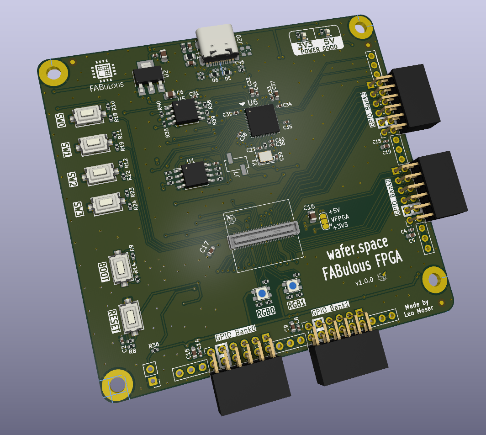

# wafer.space Main PCB

This repository holds the main PCB for [gf180mcu FABulous FPGA](https://github.com/mole99/gf180mcu-fabulous-fpga).

It is based on the [TinyTapeout Demo Board](https://github.com/TinyTapeout/tt-demo-pcb). Thanks a lot!

The PCB was designed with KiCad version 10.0.

Check out the project in your browser using KiCanvas: [wafer.space Main PCB](https://kicanvas.org/?github=https://github.com/mole99/waferspace-main-pcb/blob/main/waferspace-main-pcb.kicad_pro)

# License

The PCB is licensed under the Apache 2 License
